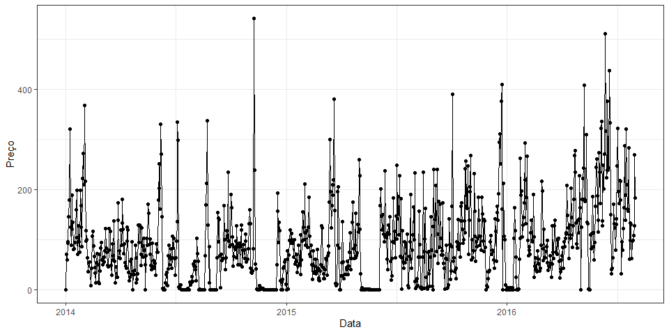

Retail Sales Forecasting - Exploratory Data Analysis
================
Autor: Rafael Barbosa da Silva |
Data: 06/04/2020

# Nota

O presente documento tem como único e simples objetivo de fazer a
análise exploratória dos dados, a parte de modelagem, cabe ao software
Python.

## Pacotes utilizados

``` r
require(tidyverse)
require(lubridate)
```

## Dados utilizados

``` r
dados <- read_csv(file = "data/mock_kaggle.csv")


dados %>% 
  head()
```

    ## # A tibble: 6 x 4
    ##   data       venda estoque preco
    ##   <date>     <dbl>   <dbl> <dbl>
    ## 1 2014-01-01     0    4972  1.29
    ## 2 2014-01-02    70    4902  1.29
    ## 3 2014-01-03    59    4843  1.29
    ## 4 2014-01-04    93    4750  1.29
    ## 5 2014-01-05    96    4654  1.29
    ## 6 2014-01-06   145    4509  1.29

## Série temporal

  - É possível notar que em alguns dias da série histórica

<!-- end list -->

``` r
dados %>% 
  ggplot(data = ., aes(x = data, y = venda)) +
  geom_line() +
  # geom_point() +
  theme_minimal(14) +
  labs(x = "Data", y = "Preço")
```

<!-- -->

# Verificar se é estacionária

# Dicas:

  - Seno

  -
