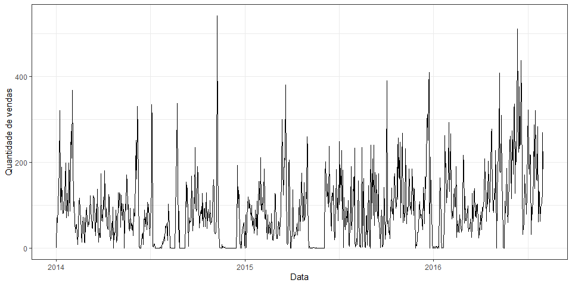
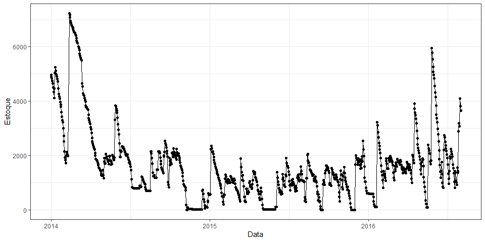

Retail Sales Forecasting
================
Autor: Rafael Barbosa da Silva |
Data: 06/04/2020

### Nota

O presente documento tem como único e simples objetivo de fazer a
análise exploratória dos dados, a parte de modelagem, cabe ao software
Python.

## Pacotes utilizados

``` r
require(tidyverse)
require(lubridate)
```

## Estrutura inicial dos dados

``` r
dados <- read_csv(file = "data/mock_kaggle.csv")


dados %>% 
  head(10)
```

    ## # A tibble: 10 x 4
    ##    data       venda estoque preco
    ##    <date>     <dbl>   <dbl> <dbl>
    ##  1 2014-01-01     0    4972  1.29
    ##  2 2014-01-02    70    4902  1.29
    ##  3 2014-01-03    59    4843  1.29
    ##  4 2014-01-04    93    4750  1.29
    ##  5 2014-01-05    96    4654  1.29
    ##  6 2014-01-06   145    4509  1.29
    ##  7 2014-01-07   179    4329  1.29
    ##  8 2014-01-08   321    4104  1.29
    ##  9 2014-01-09   125    4459  1.09
    ## 10 2014-01-10    88    5043  1.09

# Análise Exploratória dos Dados

## Série temporal de vendas

  - É possível notar que, em determinados dias da série histórica, a
    quantidade de vendas foi 0

<!-- end list -->

``` r
dados %>% 
  ggplot(data = ., aes(x = data, y = venda)) +
  geom_line() +
  theme_bw() +
  labs(x = "Data", y = "Quantidade de vendas")
```



## Série temporal do estoque

``` r
dados %>% 
  ggplot(data = ., aes(x = data, y = estoque)) +
  geom_line() +
  geom_point() +
  theme_bw() +
  labs(x = "Data", y = "Estoque")
```



# Verificar se é estacionária

# Dicas:

  - Seno

  -
